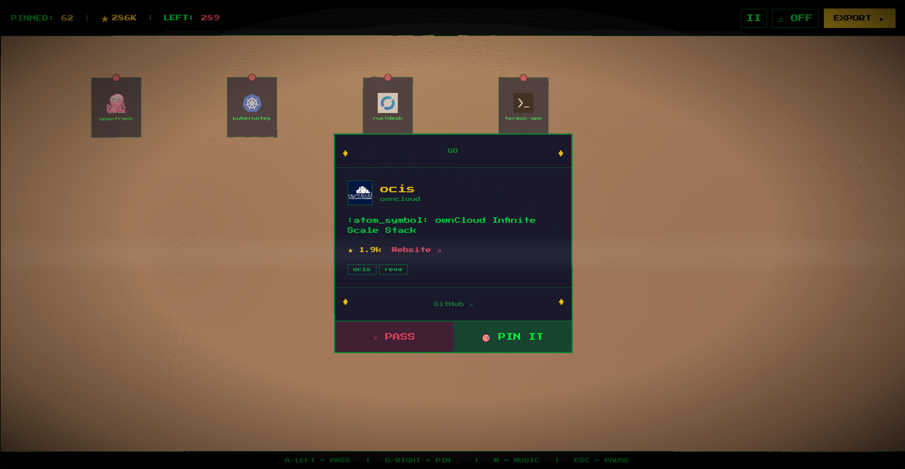

<p align="center">
  
</p>

<h1 align="center">Quiver</h1>

<p align="center">
  <i>A retro mini-game for rediscovering your GitHub stars.</i>
</p>

<p align="center">
  <a href="https://github.com/steveiliop56/quiver/releases"></a>
  <a href="https://github.com/steveiliop56/quiver/blob/main/LICENSE"></a>
  <a href="https://github.com/steveiliop56/quiver/pkgs/container/quiver"></a>
</p>

---

We all star repositories we swear we'll try later. We never do. **Quiver** turns that graveyard of good intentions into a card game. Your starred repos are dealt one at a time as playing cards on a CRT screen. See something interesting? Throw a dart and pin it to your cork board wall. Not feeling it? Let it fall. When you're done, export the survivors as Markdown or JSON.

No account linking, no backend, no token required. Just your GitHub username and a few minutes.

> [!WARNING]
> This is a vibe-coded project. I created it for fun to test out Claude. Use at your own risk.

<p align="center">
  
</p>

---

### How it works

Enter your GitHub username. Pick a deck — all your stars, or filtered by language or topic. Cards are dealt from the public GitHub API. Pin the projects that catch your eye (`D` / `Arrow Right`), dismiss the rest (`A` / `Arrow Left`). A star counter tallies the combined GitHub stars of everything you pin, with milestone celebrations at 1K, 2K, 5K, 10K and beyond. When you're satisfied, export your curated list and get back to actually trying those projects.

If you hit the API rate limit (60 requests/hour without auth), Quiver will ask for a Personal Access Token on the spot. The token lives in memory only — it is never written to disk or storage, and disappears when you close the tab.

### Running it

With Bun:

```bash
bun install
bun dev
```

With Docker:

```bash
docker run -p 8080:80 ghcr.io/steveiliop56/quiver:latest
```

Then open [localhost:8080](http://localhost:8080).

### Controls

| Key | Action |
|---|---|
| `D` / `Arrow Right` | Pin project |
| `A` / `Arrow Left` | Pass |
| `M` | Toggle chiptune music |
| `ESC` | Pause menu |

### Built with

[Vite](https://vite.dev) | [React](https://react.dev) | [TypeScript](https://typescriptlang.org) | [Tailwind CSS](https://tailwindcss.com) | [Framer Motion](https://motion.dev) | [Octokit](https://github.com/octokit/octokit.js) | Web Audio API

---

<p align="center">
  <sub>Licensed under <a href="LICENSE">MIT</a>.</sub>
</p>
